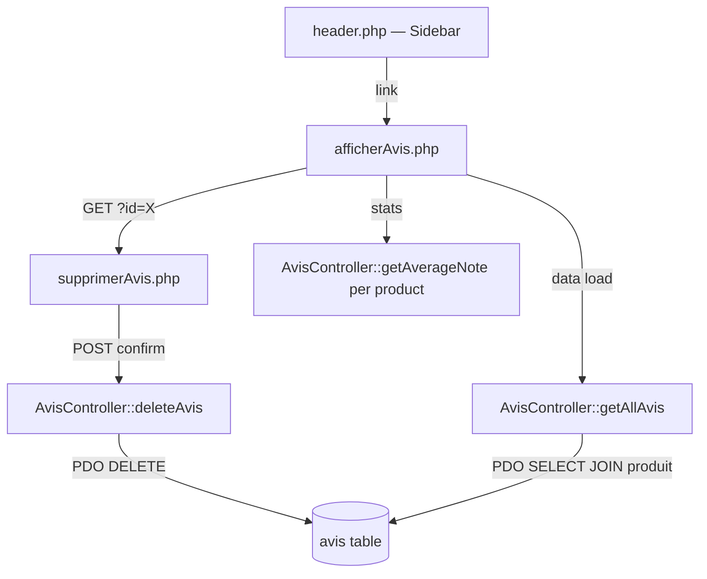
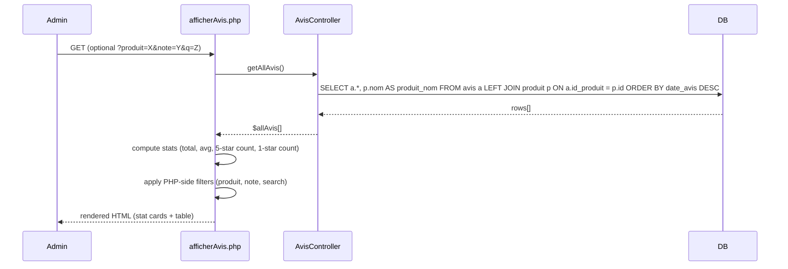
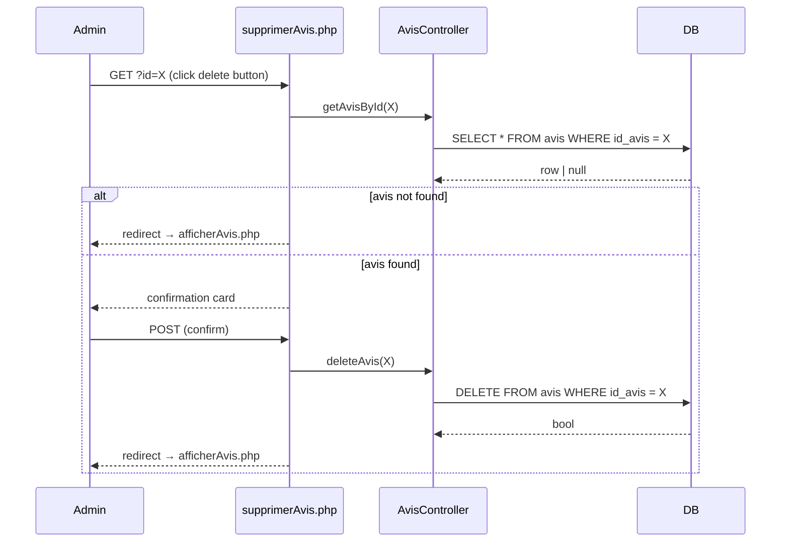

# Design Document: Gestion des Avis — Back-Office

## Overview

This feature adds a customer review management interface to the existing SmartMeal admin panel. Administrators can view all reviews with statistics and filters, and delete individual reviews. No edit capability is needed since reviews are client-submitted. The interface integrates seamlessly into the existing back-office visual system (Raleway font, `#e74c3c` red accent, white cards with box-shadow, Bootstrap Icons).

The feature touches three files: a new `afficherAvis.php` list page, a new `supprimerAvis.php` confirmation/delete page, and an update to `header.php` to add the "Avis" sidebar link below "Categories" in the Shop section.

---

## Architecture



---

## Sequence Diagrams

### List Reviews Flow



### Delete Review Flow



---

## Components and Interfaces

### Component 1: `afficherAvis.php`

**Purpose**: Main review management page. Loads all reviews, computes aggregate stats, and renders a filterable table with delete actions.

**Interface** (PHP entry point — no class, follows existing page pattern):
```php
// Inputs (GET params, all optional):
// ?produit=<int>   — filter by product ID
// ?note=<int 1-5> — filter by star rating
// ?q=<string>     — search in commentaire (case-insensitive, PHP-side)

// Dependencies:
require_once '../../config.php';
require_once '../../controller/AvisController.php';

$controller = new AvisController();
$allAvis    = $controller->getAllAvis();   // returns array of assoc rows with produit_nom
```

**Responsibilities**:
- Compute 4 stat values from `$allAvis`: total count, average note (rounded to 1 decimal), count of 5-star reviews, count of 1-star reviews
- Apply PHP-side filters (product, note, search) to produce `$filtered`
- Render stat cards, filter controls, and table
- Render star display (filled/empty `bi-star-fill` / `bi-star` icons) for each row's `note`
- Render sentiment emoji/text if `sentiment` column is present in the row (graceful: check with `isset($row['sentiment'])`)
- Render delete button linking to `supprimerAvis.php?id=<id_avis>`

### Component 2: `supprimerAvis.php`

**Purpose**: Confirmation page and POST handler for deleting a single review.

**Interface**:
```php
// GET ?id=<int>  — load review to confirm
// POST           — execute deletion

require_once '../../config.php';
require_once '../../controller/AvisController.php';

$controller = new AvisController();
$id         = (int)($_GET['id'] ?? 0);
$avis       = $controller->getAvisById($id);
// if !$avis → redirect to afficherAvis.php
// if POST   → deleteAvis($id) → redirect to afficherAvis.php
```

**Responsibilities**:
- Guard against invalid/missing ID (redirect if not found)
- Display confirmation card with review details (product name, note as stars, truncated comment)
- On POST: call `deleteAvis()` and redirect

### Component 3: `header.php` (modification)

**Purpose**: Add "Avis" sidebar link in the Shop section, below "Categories".

**Changes**:
- Add one `<a>` tag after the Categories link in the Shop nav section
- Add `afficherAvis.php` and `supprimerAvis.php` to the active-state detection array
- Add entries for `afficherAvis.php` and `supprimerAvis.php` to the `$titles` map in the topbar

---

## Data Models

### Avis row (from `getAllAvis()`)

```php
// Assoc array returned by PDO::fetchAll()
[
    'id_avis'     => int,
    'note'        => int,        // 1–5
    'commentaire' => string,
    'date_avis'   => string,     // 'YYYY-MM-DD' or datetime string
    'id_produit'  => int,
    'produit_nom' => string,     // joined from produit.nom (may be null if orphan)
    'sentiment'   => string|null // optional column — check with isset()
]
```

**Validation Rules**:
- `note` is always 1–5 (enforced at insert time by front-office)
- `id_avis` is always a positive integer
- `produit_nom` may be null if the product was deleted (LEFT JOIN)
- `sentiment` column may not exist in all DB instances — use `isset()` / `array_key_exists()`

### Stat aggregates (computed in PHP)

```php
$totalAvis   = count($allAvis);
$avgNote     = $totalAvis > 0 ? round(array_sum(array_column($allAvis, 'note')) / $totalAvis, 1) : 0;
$count5Stars = count(array_filter($allAvis, fn($a) => (int)$a['note'] === 5));
$count1Star  = count(array_filter($allAvis, fn($a) => (int)$a['note'] === 1));
```

---

## Key Functions with Formal Specifications

### Function 1: `renderStars(int $note): string`

Inline helper (defined in `afficherAvis.php`) that converts a numeric note to Bootstrap Icon star HTML.

```php
function renderStars(int $note): string {
    $html = '';
    for ($i = 1; $i <= 5; $i++) {
        $html .= $i <= $note
            ? '<i class="bi bi-star-fill" style="color:#f57f17;font-size:0.8rem;"></i>'
            : '<i class="bi bi-star"      style="color:#ddd;font-size:0.8rem;"></i>';
    }
    return $html;
}
```

**Preconditions:**
- `$note` is an integer between 1 and 5 inclusive

**Postconditions:**
- Returns a string of exactly 5 `<i>` elements
- First `$note` icons use `bi-star-fill` (gold), remaining use `bi-star` (grey)
- No side effects

### Function 2: PHP filter pipeline in `afficherAvis.php`

```php
// Applied after getAllAvis() returns $allAvis
$filterProduit = (int)($_GET['produit'] ?? 0);
$filterNote    = (int)($_GET['note']    ?? 0);
$filterSearch  = trim($_GET['q']        ?? '');

$filtered = array_filter($allAvis, function($a) use ($filterProduit, $filterNote, $filterSearch) {
    if ($filterProduit && (int)$a['id_produit'] !== $filterProduit) return false;
    if ($filterNote    && (int)$a['note']        !== $filterNote)    return false;
    if ($filterSearch  && stripos($a['commentaire'], $filterSearch) === false) return false;
    return true;
});
$filtered = array_values($filtered);
```

**Preconditions:**
- `$allAvis` is a valid array (may be empty)
- GET params are sanitized to int/string before use

**Postconditions:**
- `$filtered` is a subset of `$allAvis`
- If all filter params are 0/empty, `$filtered === $allAvis`
- Order is preserved (same as `getAllAvis()` order: DESC by date)

**Loop Invariants:**
- Each element in `$filtered` satisfies all active filter conditions

---

## Algorithmic Pseudocode

### Main Page Algorithm

```pascal
ALGORITHM renderAfficherAvis
INPUT: GET params (produit?, note?, q?)
OUTPUT: HTML page

BEGIN
  // 1. Load data
  allAvis ← AvisController.getAllAvis()

  // 2. Compute stats
  totalAvis   ← COUNT(allAvis)
  avgNote     ← totalAvis > 0 ? ROUND(SUM(allAvis.note) / totalAvis, 1) : 0
  count5Stars ← COUNT(allAvis WHERE note = 5)
  count1Star  ← COUNT(allAvis WHERE note = 1)

  // 3. Build product list for filter dropdown
  products ← DISTINCT { id_produit, produit_nom } FROM allAvis

  // 4. Apply filters
  filterProduit ← (int) GET['produit'] OR 0
  filterNote    ← (int) GET['note']    OR 0
  filterSearch  ← TRIM(GET['q'])       OR ''

  filtered ← allAvis
  IF filterProduit ≠ 0 THEN
    filtered ← filtered WHERE id_produit = filterProduit
  END IF
  IF filterNote ≠ 0 THEN
    filtered ← filtered WHERE note = filterNote
  END IF
  IF filterSearch ≠ '' THEN
    filtered ← filtered WHERE CONTAINS(commentaire, filterSearch)
  END IF

  // 5. Render
  RENDER header.php
  RENDER dashboard-banner
  RENDER stat-cards (totalAvis, avgNote, count5Stars, count1Star)
  RENDER filter-row (product select, note select, search input)
  RENDER table (filtered rows)
  FOR EACH avis IN filtered DO
    RENDER row: #, produit_nom, renderStars(note), commentaire (truncated), date_avis, sentiment?, [Delete button]
  END FOR
  IF COUNT(filtered) = 0 THEN
    RENDER empty-state row
  END IF
  RENDER footer.php
END
```

### Delete Algorithm

```pascal
ALGORITHM renderSupprimerAvis
INPUT: GET id, POST (optional)
OUTPUT: confirmation page OR redirect

BEGIN
  id   ← (int) GET['id'] OR 0
  avis ← AvisController.getAvisById(id)

  IF avis = NULL THEN
    REDIRECT → afficherAvis.php
    STOP
  END IF

  IF REQUEST_METHOD = 'POST' THEN
    AvisController.deleteAvis(id)
    REDIRECT → afficherAvis.php
    STOP
  END IF

  // GET: show confirmation
  RENDER header.php
  RENDER confirm-card:
    icon: bi-exclamation-triangle-fill
    title: "Supprimer l'avis"
    body: product name + note stars + truncated comment
    [Confirm POST button] [Cancel link → afficherAvis.php]
  RENDER footer.php
END
```

---

## Example Usage

### Accessing the page

```
# List all reviews
http://localhost/view/back/afficherAvis.php

# Filter by product ID 3
http://localhost/view/back/afficherAvis.php?produit=3

# Filter by 5-star reviews
http://localhost/view/back/afficherAvis.php?note=5

# Search in comments
http://localhost/view/back/afficherAvis.php?q=excellent

# Combined filters
http://localhost/view/back/afficherAvis.php?produit=3&note=4&q=bon

# Delete review ID 7 (GET → confirmation)
http://localhost/view/back/supprimerAvis.php?id=7

# Delete review ID 7 (POST → executes, redirects)
POST http://localhost/view/back/supprimerAvis.php?id=7
```

### Sidebar link (header.php addition)

```php
<a href="afficherAvis.php"
   class="<?= in_array($currentPage, ['afficherAvis.php','supprimerAvis.php']) ? 'active' : '' ?>">
  <i class="bi bi-chat-square-text"></i> Avis
</a>
```

---

## Error Handling

### Scenario 1: Invalid or missing review ID on delete

**Condition**: `supprimerAvis.php` receives `?id=0`, a non-numeric value, or an ID that doesn't exist in the DB.

**Response**: `getAvisById()` returns `null`. The page immediately redirects to `afficherAvis.php` with no error message shown (silent guard, consistent with `supprimerCategorie.php` pattern).

**Recovery**: Admin is returned to the list page.

### Scenario 2: No reviews in the database

**Condition**: `getAllAvis()` returns an empty array.

**Response**: Stat cards show `0` / `0.0`. The table renders a single "No reviews found" row with an inbox icon. Filter controls are still visible.

**Recovery**: No action needed; the page is functional and will populate when reviews are added.

### Scenario 3: `sentiment` column absent from DB

**Condition**: The `avis` table was created without the `sentiment` column (older schema).

**Response**: `getAllAvis()` returns rows without a `sentiment` key. The view checks `isset($avis['sentiment'])` before rendering the sentiment cell. If absent, the cell renders a `—` dash.

**Recovery**: Transparent to the admin; no error is thrown.

### Scenario 4: Orphaned review (product deleted)

**Condition**: `produit_nom` is `null` because the product was deleted after the review was submitted (LEFT JOIN returns NULL).

**Response**: The product name cell renders "—" or "Produit supprimé" in muted text.

**Recovery**: Admin can still delete the orphaned review normally.

---

## Testing Strategy

### Unit Testing Approach

- Test `AvisController::getAllAvis()` returns an array with `produit_nom` key (JOIN works)
- Test `AvisController::getAvisById()` returns `null` for non-existent ID
- Test `AvisController::deleteAvis()` returns `true` and the row is gone from DB
- Test `renderStars()` helper: note=1 → 1 filled + 4 empty; note=5 → 5 filled; note=3 → 3 filled + 2 empty

### Property-Based Testing Approach

**Property Test Library**: No PBT library is currently used in this PHP project. Manual test cases cover the key properties.

Key properties to verify manually:
- For any `$note` in [1..5]: `renderStars($note)` always returns exactly 5 `<i>` elements
- For any filter combination: `count($filtered) <= count($allAvis)`
- For any `$allAvis` array: `$avgNote` is always in [1.0..5.0] when `$totalAvis > 0`, and `0` when empty

### Integration Testing Approach

- Load `afficherAvis.php` in browser with known DB data; verify stat cards match expected counts
- Apply each filter individually and verify table rows match the filter condition
- Click delete on a review, confirm, verify redirect to list and row is gone
- Access `supprimerAvis.php?id=99999` (non-existent), verify redirect to list

---

## Performance Considerations

- `getAllAvis()` performs a single `SELECT … LEFT JOIN` query — O(n) where n = total reviews. Acceptable for typical back-office volumes (hundreds to low thousands of reviews).
- Filtering is done PHP-side after a full fetch. This is consistent with the existing pattern in `afficherCategorie.php` and `afficherProduit.php`. If the review count grows large (>10k), a future optimization would push filters into the SQL `WHERE` clause.
- No pagination is implemented in the initial version, matching the existing pages' approach.

---

## Security Considerations

- All output is wrapped in `htmlspecialchars()` to prevent XSS.
- The delete ID is cast to `(int)` before use in the PDO prepared statement — no SQL injection risk.
- The delete action requires a POST request (confirmation form), preventing accidental deletion via GET (CSRF-safe for the current no-auth admin context; a CSRF token can be added when authentication is introduced).
- No file uploads or user-controlled data paths are involved.

---

## Dependencies

| Dependency | Already present | Notes |
|---|---|---|
| `config.php` | ✅ | `config::getConnexion()` for PDO |
| `model/Avis.php` | ✅ | Avis entity class |
| `controller/AvisController.php` | ✅ | All needed methods exist |
| Bootstrap Icons (`bi-*`) | ✅ | Loaded in `header.php` |
| Raleway font | ✅ | Loaded in `header.php` |
| Bootstrap CSS | ✅ | Loaded in `header.php` |
| `header.php` / `footer.php` | ✅ | Shared layout includes |

No new dependencies are required.
